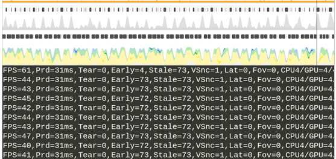

# WebXR and Browsers
##### Imanol Fernandez
###### Igalia, September 2021

----
<!-- .slide: class="igalia-align-left" -->
### Today, we are going to talk about
+ Main challenges behind a WebXR Browser
	+ Rendering
	+ UI
	+ Privacy
+ Solution to address each challenge

----

#### Stereo Rendering


----

#### Problem: Distortion

Lens Distortion


Pincushion Distortion.


----

#### Solution: Distortion pass

Compensate with Barrel Distortion


----

#### Problem: Chromatic Aberration


Lens cause different wavelengths of light to have differing focal lengths <!-- .element: class="igalia-text-small" -->

----

#### Solution: Chromatic Aberration pass

##### Compensate Chromatic Aberration


----

#### Problem: Motion to Photon Latency


* MTP <=20ms
* Motion sickness & nausea
* 120 Hz, 90 Hz, 72 Hz, 60Hz

----

#### Solution: Optimize Browser + XR Engine Pipeline

Classic render pipeline


How to optimize it?

----

#### XR Engine Pipeline

Multi-camera


Easiest option, but the slowest.

----

#### XR Engine Pipeline

Multi-pass


* Optimized VR render loop
* Extract eye-independent steps

----

#### Multi-pass combined frustrum


----

#### VR Engine Pipeline

Single-pass


* Multiview: 40% improvements in CPU bound apps
* Submit scene commands ONCE

----

#### WebGL OVR_multiview2 


----

#### XR Engine Pipeline: GPU Bound 

Foveated Rendering


----

### WebXR Foveated Rendering
You can request Foveated Rendering as an optional feature.<!-- .element: class="igalia-text-small" -->

``` js
navigator.xr.requestSession('immersive-vr', {
    requiredFeatures: ['local-floor'],
    optionalFeatures: ['high-fixed-foveation-level']
})
```

----

#### XR Engine Pipeline: Stability 

All this is not enough


----

#### Asynchronous TimeWarp

<video controls data-autoplay loop style="max-width: 95%;">
	<source src="videos/tw1.mp4" type="video/mp4">                                                                       
</video>

----

<h5>Without frame prediction</h5>

<h5>After implementing frame prediction</h5>


----
<!-- .slide: class="igalia-align-left" -->
### Today, we are going to talk about
+ Main challenges behind a WebXR Browser
	+ Rendering
	+ **UI**
	+ Privacy
+ Solution to address each challenge

----

### Redesigned UI for Standalone Browser
<figure class="video_container">
	<video controls data-autoplay loop style="max-width: 70%;">
		<source src="videos/wpe_vr.mp4" type="video/mp4">                                                                      
	</video>
</figure>

----

#### Standalone browser pipeline


Performance + External ok, but still a quality problem

----

#### Quality problems due to texture sampling


1. Original quality: 2K or 4K
2. Eye framebuffer size: 1K on Oculus Go (1024 x 1024)
3. Placement on the scene: e.g 512 px
4. Distortion pass: only 512px available to toy with

----

#### Solution: XR Compositor Layers


* They bypass eye buffers completely
* Unique Texture sample (directly from distortion mesh)
* Resolution: 1024x1024 (eye) vs max 6000x3000 (layers)
* Subpixel precision, oclussion, etc
* No need to scale main eye buffer (e.g. 1.5x with 4x MSAA)


----

#### XR Compositor Layers


* 3D Projection
* Quad
* Cubemap
* Equirectangular
* Cylindrical

----
<!-- .slide: class="igalia-align-left" -->
### Today, we are going to talk about
+ Main challenges behind a WebXR Browser
	+ Rendering
	+ UI
	+ **Privacy**
+ Solution to address each challenge

----
#### Hand Tracking Input


* Exposes articulated hand poses.
* Risks: fingerprinting, track gender, age, medical problems, etc.
* Solution: Explicit consent and Rounding/noising.

----
#### Eye Tracking


Solutions
* Explicit consent
* Internal use by UA and VR Compositor.

----
#### WebXR: AR & World Understanding


- New privacy risks: users' physical environment

----

## The End

Any questions?

Ask ifernandez@igalia.com for help!
